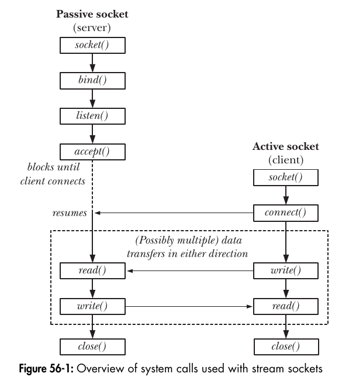
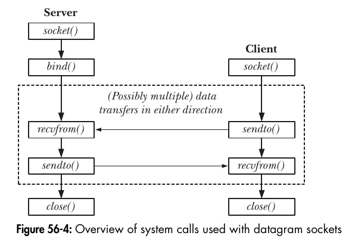

## Interprocess communication
The general term interprocess communication (IPC) is often used to describe these facilities:
- *Communication:* These facilities are concerned with exchanging data between
processes.
- *Synchronization:* These facilities are concerned with synchronizing the actions
of processes or thread
- *Signals:* Although signals are intended primarily for other purposes, they can
be used as a synchronization technique in certain circumstances


### Functionality and Accessibility
- Some data-transfer facilities transfer data as a byte stream (pipes, FIFOs, and stream sockets); others are message-oriented (message queues and datagram sockets).

- For some IPC facilities (e.g., FIFOs and sockets), object names live in the file system, and accessibility is determined according to the associated file permissions mask, which specifies permissions for owner, group, and other

## Communication facilities
- *Data-transfer facilities:* The key factor distinguishing these facilities is the notion of writing and reading. In order to communicate, one process writes data to
the IPC facility, and another process reads the data. These facilities require two
data transfers between user memory and kernel memory: one transfer from
user memory to kernel memory during writing, and another transfer from
kernel memory to user memory during reading.
- *Shared memory:* Shared memory allows processes to exchange information by
placing it in a region of memory that is shared between the processes

*A few general features distinguish data-transfer facilities from shared memory:*
- Although a data-transfer facility may have multiple readers, reads are destructive. A read operation consumes data, and that data is not available to any
other process.The MSG_PEEK flag can be used to perform a nondestructive read from a socket
- Synchronization between the reader and writer processes is automatic. If a
reader attempts to fetch data from a data-transfer facility that currently has no
data, then the read operation will block until some process writes
data to the facility.


## Synchronization facilities
Synchronization  facilities allow processes to coordinate their actions. Synchronization allows processes to avoid doing things such as simultaneously updating a shared memory region or the same part of a file
- Semaphores: A semaphore is a kernel-maintained integer whose value is never
permitted to fall below 0. A process can decrease or increase the value of a
semaphore
- File locks: File locks are a synchronization method explicitly designed to coordinate the actions of multiple processes operating on the same file.
- Mutexes and condition variables: Mutexes ensure that only one thread or process can access a shared resource at a time, preventing race conditions.  Condition variables allow threads to wait for specific conditions to be met.     They work with mutexes, putting threads to sleep until another thread signals the condition, indicating that the condition is met.

- Since kernel 2.6.22, Linux provides an additional, nonstandard synchronization mechanism via the eventfd() system call.


## Pipes
A pipe is simply a buffer maintained in kernel memory. This buffer has a maximum
capacity. Once a pipe is full, further writes to the pipe block until the reader removes some data from the pipe.
The pipe() system call creates a new pipe.

```c
#include <unistd.h>

int pipe(int filedes[2]);

// Returns 0 on success, or -1 on error
```

A successful call to pipe() returns two open file descriptors in the array filedes: one for the read end of the pipe ( filedes[0]) and one for the write end ( filedes[1]). As with any file descriptor, we can use the read() and write() system calls to perform I/O on the pipe.

*-Starting with kernel 2.6.27, Linux supports a new, nonstandard system call,
pipe2().*

=============================================================================
Closing unused pipe file descriptors is more than a matter of ensuring that a process doesn’t exhaust its limited set of file descriptors. If the reading process doesn’t close the write end of the pipe, then, after the other process closes its write descriptor, the reader won’t see end-of-file, even after it has read all data from the pipe.
The writing process closes its read descriptor for the pipe for a different reason.
When a process tries to write to a pipe for which no process has an open read
descriptor, the kernel sends the SIGPIPE signal to the writing process. By default,this signal kills a process


## FIFOs
Semantically, a FIFO is similar to a pipe. The principal difference is that a FIFO hasa name within the file system and is opened in the same way as a regular file. This allows a FIFO to be used for communication between unrelated processes (e.g., a client and server). FIFOs are also sometimes known as named pipes.

The mkfifo() function creates a new FIFO with the given pathname.
```c
#include <sys/stat.h>

int mkfifo(const char *pathname, mode_t mode);

// Returns 0 on success, or -1 on error
```

Once a FIFO has been created, any process can open it, subject to the usual file permission checks


## POSIX Message Queues
POSIX message queues allow processes to exchange data in the form of messages.
Each message has an associated integer priority, and messages are queued (and thus received) in order of priority. POSIX message queues provide a notification facility that can send a signal to a process, or instantiate a new thread, when a message arrives on a previously empty queue.

## POSIX Semaphores
- Named semaphores: This type of semaphore has a name. By calling sem_open()
with the same name, unrelated processes can access the same semaphore.
- Unnamed semaphores: This type of semaphore doesn’t have a name; instead, it resides at an agreed-upon location in memory. Unnamed semaphores can be shared between processes or between a group of threads. When shared between processes, the semaphore must reside in a region of (System V,POSIX, or mmap()) shared memory. When shared between threads, the semaphore may reside in an area of memory shared by the threads (e.g., on the heap or in a global variable).

POSIX semaphore is an integer whose value is not permitted to fall below 0. If a process attempts to decrease the value of a semaphore below 0, then, depending on the function used, the call either blocks or fails with an error indicating that the operation was not currently possible.

```c
sem_t *sem_open(const char *name, int oflag, ... /* mode_t mode, unsigned int value */ );
int sem_close(sem_t *sem);
int sem_unlink(const char *name);
int sem_wait(sem_t *sem);
int sem_post(sem_t *sem);
int sem_init(sem_t *sem, int pshared, unsigned int value);
int sem_destroy(sem_t *sem);
```
sem_post() and sem_wait() operate on just one semaphore at a time. By contrast, the System V semop() system call can operate on multiple semaphores in a set.

The sem_post() and sem_wait() functions increment and decrement a semaphore’s
value by exactly one. By contrast, semop() can add and subtract arbitrary values.


Named semaphores are typically identified by a name in the filesystem namespace (e.g., /dev/shm/sem.my_semaphore). They can be accessed and used by any process that knows the name and has appropriate permissions, regardless of whether they belong to the same process group or even the same user.


#### POSIX semaphores versus Pthreads mutexes
POSIX semaphores and Pthreads mutexes can both be used to synchronize the actions of threads within the same process, and their performance is similar. However, mutexes are usually preferable, because the ownership property of mutexes enforces good structuring of code (only the thread that locks a mutex can unlock it). By contrast, one thread can increment a semaphore that was decremented by another thread. This flexibility can lead to poorly structured synchronization designs. (For this reason, semaphores are sometimes referred to as the “gotos” of concurrent programming.)


## POSIX Shared Memory
POSIX shared memory allows to us to share a mapped region between unrelated
processes without needing to create a corresponding mapped file. Although shared memory provides fast communication, this speed advantage is offset by the need to synchronize operations on the shared memory.

To use a POSIX shared memory object, we perform two steps:
1. Use the shm_open() function to open an object with a specified name. 
2. Pass the file descriptor obtained in the previous step in a call to mmap() that
specifies MAP_SHARED in the flags argument. This maps the shared memory object
into the process’s virtual address space. 
```c
int shm_open(const char *name, int oflag, mode_t mode);
int shm_unlink(const char *name);
```


## File Locking
File locks allow processes to synchronize access to a file. Linux provides two file
locking system calls: the BSD-derived flock() and the System V–derived fcntl().

- The flock() system call locks an entire file. Two types of locks may be placed:
shared locks, which are compatible with shared locks held by other processes, and exclusive locks, which prevent other processes from placing any type of lock.
- The fcntl() system call places locks (“record locks”) on any region of a file, ranging from a single byte to the entire file. Two types of locks may be placed: read locks and write locks, which have similar compatibility semantics to the shared and exclusive locks placed via flock(). If a blocking (F_SETLKW) lock request would bring about a deadlock situation, then the kernel causes fcntl() to fail (with the error EDEADLK) in one of the affected processes.


## Sockets
Of all of the IPC methods shown, only sockets permit processes to communicate over a network.
Sockets are a method of IPC that allow data to be exchanged between applications, either on the same host (computer) or on different hosts connected by a network. 
In a typical client-server scenario, applications communicate using sockets as follows:
- Each application creates a socket. A socket is the “apparatus” that allows com-
munication, and both applications require one.
- The server binds its socket to a well-known address (name) so that clients can
locate it.
A socket is created using the socket() system call, which returns a file descriptor used
to refer to the socket in subsequent system calls:
```c
#include <sys/socket.h>

// The socket() system call creates a new socket.
int socket(int domain, int type, int protocol );
// The bind() system call binds a socket to an address.
int bind(int sockfd, const struct sockaddr *addr, socklen_t addrlen);
```

#### Communication domains
Modern operating systems support at least the following domains:

| Domain     | Communication performed  | Communication between applications                   | Address format                            | Address structure |
|------------|--------------------------|-----------------------------------------------------|-------------------------------------------|-------------------|
| AF_UNIX    | within kernel            | on same host                                        | pathname                                  | sockaddr_un       |
| AF_INET    | via IPv4                 | on hosts connected via an IPv4 network              | 32-bit IPv4 address + 16-bit port number  | sockaddr_in       |
| AF_INET6   | via IPv6                 | on hosts connected via an IPv6 network              | 128-bit IPv6 address + 16-bit port number | sockaddr_in6      |


#### Socket types
Every sockets implementation provides at least two types of sockets: stream and
datagram. 
|                             | Stream           | Datagram       |
|-----------------------------|------------------|----------------|
| Reliable delivery?          | Y                | N              |
| Message boundaries preserved?| N               | Y              |
| Connection-oriented?        | Y                | N              |

Stream sockets operate in connected pairs. For this reason, stream sockets are
described as connection-oriented.
Datagram sockets (SOCK_DGRAM) allow data to be exchanged in the form of mes-
sages called datagrams. 
In the Internet domain, datagram sockets employ the User Datagram Protocol
(UDP), and stream sockets (usually) employ the Transmission Control Protocol (TCP).


### Stream sockets
The operation of stream sockets can be explained by analogy with the telephone
system:
1. The socket() system call, which creates a socket, is the equivalent of installing a telephone. In order for two applications to communicate, each of them must create a socket.
2. Communication via a stream socket is analogous to a telephone call. One applica tion must connect its socket to another application’s socket before communication can take place. Two sockets are connected as follows:
    - One application calls bind() in order to bind the socket to a well-known
    address, and then calls listen() to notify the kernel of its willingness to accept incoming connections. This step is analogous to having a known telephone number and ensuring that our telephone is turned on so that people can call us.
    - The other application establishes the connection by calling connect(), speci-
    fying the address of the socket to which the connection is to be made. This is analogous to dialing someone’s telephone number.
    - The application that called listen() then accepts the connection using accept().
    This is analogous to picking up the telephone when it rings. If the accept() is
    performed before the peer application calls connect(), then the accept() blocks
    (“waiting by the telephone”).

3. Once a connection has been established, data can be transmitted in both directions between the applications (analogous to a two-way telephone conversation) until one of them closes the connection using close(). Communication is performed using the conventional read() and write() system calls or via a number of socket specific system calls (such as send() and recv()) that provide additional functionality.


```c
//The listen() system call marks the stream socket referred to by the file descriptor sockfd as passive.
int listen(int sockfd, int backlog);
// The accept() system call accepts an incoming connection on the listening stream socket referred to by the file descriptor sockfd
int accept(int sockfd, struct sockaddr *addr, socklen_t *addrlen);
// The connect() system call connects the active socket referred to by the file descriptor sockfd to the listening socket whose address is specified by addr and addrlen.
int connect(int sockfd, const struct sockaddr *addr, socklen_t addrlen);
```




## Datagram sockets
The operation of datagram sockets can be explained by analogy with the postal system: 
1. The socket() system call is the equivalent of setting up a mailbox. (Here, we assume a system like the rural postal service in some countries, which both picks up letters from and delivers letters to the mailbox.) Each application that wants to send or receive datagrams creates a datagram socket using socket().
2. In order to allow another application to send it datagrams (letters), an application uses bind() to bind its socket to a well-known address. Typically, a server binds its socket to a well-known address, and a client initiates communication by sending a datagram to that address. (In some domains—notably the UNIX domain—the client may also need to use bind() to assign an address to its socket if it wants to receive datagrams sent by the server.)
3. To send a datagram, an application calls sendto(), which takes as one of its argu- ments the address of the socket to which the datagram is to be sent. This is analogous to putting the recipient’s address on a letter and posting it.
4. In order to receive a datagram, an application calls recvfrom(), which may block if no datagram has yet arrived. Because recvfrom() allows us to obtain the address of the sender, we can send a reply if desired. (This is useful if the sender’s socket is bound to an address that is not well known, which is typical of a client.) Here, we stretch the analogy a little, since there is no requirement that a posted letter is marked with the sender’s address.
5. When the socket is no longer needed, the application closes it using close().

```c
#include <sys/socket.h>
// The recvfrom() and sendto() system calls receive and send datagrams on a datagram socket.
ssize_t recvfrom(int sockfd, void *buffer, size_t length, int flags, struct sockaddr *src_addr, socklen_t *addrlen);
ssize_t sendto(int sockfd, const void *buffer, size_t length, int flags, const struct sockaddr *dest_addr, socklen_t addrlen);
```

Even though datagram sockets are connectionless, the connect() system call serves a purpose when applied to datagram sockets. Calling connect() on a datagram socket causes the kernel to record a particular address as this socket’s peer. 



